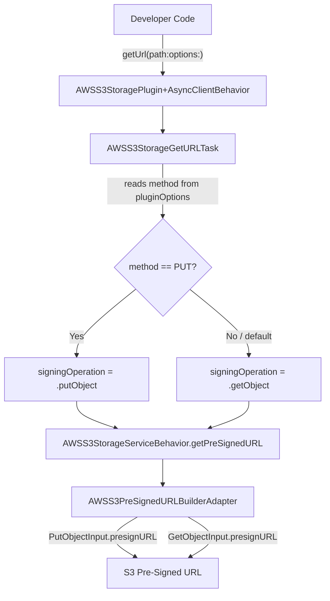

# Design Document: Pre-Signed URL Upload Support

## Overview

This design extends the existing `getUrl` API in the Amplify Swift Storage plugin to support pre-signed URL generation for PUT (upload) operations. The change is minimal and surgical: a new `method` property is added to `AWSStorageGetURLOptions` (the plugin-specific options struct), and the `AWSS3StorageGetURLTask` is updated to select the appropriate `AWSS3SigningOperation` based on that method. No new public APIs, tasks, or service methods are introduced.

The existing infrastructure already supports `putObject` signing via `AWSS3SigningOperation.putObject` and `AWSS3PreSignedURLBuilderAdapter`. The core work is threading the method choice from the public API surface down to the signing operation selection.

## Architecture

The change follows the existing layered architecture of the Storage plugin:



The data flow is:
1. Developer calls `getUrl(path:options:)` with `pluginOptions: AWSStorageGetURLOptions(method: .put)`
2. `AWSS3StorageGetURLTask.execute()` reads the `method` from plugin options
3. Task selects `AWSS3SigningOperation.putObject` or `.getObject` accordingly
4. The existing `AWSS3StorageServiceBehavior.getPreSignedURL` is called with the chosen signing operation
5. `AWSS3PreSignedURLBuilderAdapter` already handles both `putObject` and `getObject` cases

## Components and Interfaces

### Modified Components

#### 1. `AWSStorageGetURLOptions`
**File:** `AmplifyPlugins/Storage/Sources/AWSS3StoragePlugin/Request/GetURL/AWSStorageGetURLOptions.swift`

Add a `method` property and an optional `contentType` property:

```swift
public struct AWSStorageGetURLOptions {
    
    /// The HTTP method for the pre-signed URL.
    /// Use `.put` to generate an upload URL, `.get` (default) for a download URL.
    public enum HTTPMethod: String {
        case get = "GET"
        case put = "PUT"
    }
    
    public var validateObjectExistence: Bool = false
    
    /// The HTTP method for the pre-signed URL. Defaults to `.get`.
    public var method: HTTPMethod = .get
    
    /// The content type for PUT pre-signed URLs. Ignored for GET URLs.
    public var contentType: String?
    
    public init(
        validateObjectExistence: Bool = false,
        method: HTTPMethod = .get,
        contentType: String? = nil
    ) {
        self.validateObjectExistence = validateObjectExistence
        self.method = method
        self.contentType = contentType
    }
    
    // Preserve existing initializer for backward compatibility
    public init(validateObjectExistence: Bool) {
        self.validateObjectExistence = validateObjectExistence
        self.method = .get
        self.contentType = nil
    }
}
```

#### 2. `AWSS3StorageGetURLTask`
**File:** `AmplifyPlugins/Storage/Sources/AWSS3StoragePlugin/Tasks/AWSS3torageGetURLTask.swift`

Update `execute()` to read the method from plugin options and select the signing operation:

```swift
func execute() async throws -> URL {
    guard let serviceKey = try await request.path?.resolvePath() else {
        throw StorageError.validation(
            "path",
            "`path` is required field",
            "Make sure that a valid `path` is passed for removing an object"
        )
    }

    let pluginOptions = request.options.pluginOptions as? AWSStorageGetURLOptions
    let method = pluginOptions?.method ?? .get

    // Only validate object existence for GET operations
    if method == .get,
       let pluginOptions,
       pluginOptions.validateObjectExistence {
        try await storageBehaviour.validateObjectExistence(serviceKey: serviceKey)
    }

    let accelerate = try AWSS3PluginOptions.accelerateValue(
        pluginOptions: request.options.pluginOptions)

    let signingOperation: AWSS3SigningOperation
    let metadata: [String: String]?

    switch method {
    case .put:
        signingOperation = .putObject
        if let contentType = pluginOptions?.contentType {
            metadata = ["Content-Type": contentType]
        } else {
            metadata = nil
        }
    case .get:
        signingOperation = .getObject
        metadata = nil
    }

    do {
        return try await storageBehaviour.getPreSignedURL(
            serviceKey: serviceKey,
            signingOperation: signingOperation,
            metadata: metadata,
            accelerate: accelerate,
            expires: request.options.expires
        )
    } catch let error as StorageErrorConvertible {
        throw error.storageError
    } catch {
        throw StorageError.service(
            "Service error occurred.",
            "Please inspect the underlying error for more details.",
            error
        )
    }
}
```

### Unchanged Components

- **`StorageGetURLRequest`** — No changes. The `method` lives in `pluginOptions`, not in the core request options.
- **`AWSS3StorageServiceBehavior`** — No changes. Already accepts `AWSS3SigningOperation` which includes `.putObject`.
- **`AWSS3PreSignedURLBuilderAdapter`** — No changes. Already handles `putObject` signing via `PutObjectInput.presignURL`.
- **`AWSS3StoragePlugin+AsyncClientBehavior`** — No changes. The path-based `getUrl` already delegates to `AWSS3StorageGetURLTask`.

## Data Models

### New Types

#### `AWSStorageGetURLOptions.HTTPMethod`
```swift
public enum HTTPMethod: String {
    case get = "GET"
    case put = "PUT"
}
```

A simple enum nested inside `AWSStorageGetURLOptions`. Using `String` raw values for clarity and debuggability.

### Modified Types

#### `AWSStorageGetURLOptions`
Two new stored properties added:
- `method: HTTPMethod` — defaults to `.get`
- `contentType: String?` — optional, only relevant for `.put`

The existing `validateObjectExistence` property is unchanged. A new initializer is added that accepts all three parameters, while the existing single-parameter initializer is preserved for backward compatibility.

### Unchanged Types

- `StorageGetURLRequest` and `StorageGetURLRequest.Options` — unchanged
- `AWSS3SigningOperation` — already has `.putObject` case
- `AWSS3PreSignedURLBuilderBehavior` — already accepts signing operation and metadata


## Correctness Properties

*A property is a characteristic or behavior that should hold true across all valid executions of a system — essentially, a formal statement about what the system should do. Properties serve as the bridge between human-readable specifications and machine-verifiable correctness guarantees.*

### Property 1: Method-to-signing-operation mapping

*For any* valid storage path and *for any* `AWSStorageGetURLOptions.HTTPMethod` value, the `AWSS3StorageGetURLTask` shall invoke `getPreSignedURL` with `AWSS3SigningOperation.putObject` when the method is `.put`, and with `AWSS3SigningOperation.getObject` when the method is `.get` (or when no method is specified).

**Validates: Requirements 1.2, 1.3, 1.4**

### Property 2: ContentType metadata conditional inclusion

*For any* valid storage path, *for any* `HTTPMethod` value, and *for any* optional content type string, the metadata dictionary passed to `getPreSignedURL` shall contain the content type if and only if the method is `.put` and the content type is non-nil. When the method is `.get`, metadata shall be nil regardless of the content type value.

**Validates: Requirements 3.2, 3.3, 5.3**

### Property 3: Expiration forwarding for PUT

*For any* valid storage path and *for any* positive expiration value, when the method is `.put`, the `AWSS3StorageGetURLTask` shall pass the expiration value through to `getPreSignedURL` unchanged.

**Validates: Requirements 4.1**

### Property 4: Object existence validation conditional on method

*For any* valid storage path and *for any* `HTTPMethod` value, when `validateObjectExistence` is true, the `AWSS3StorageGetURLTask` shall call `validateObjectExistence` if and only if the method is `.get`. When the method is `.put`, the existence check shall be skipped regardless of the `validateObjectExistence` setting.

**Validates: Requirements 6.1, 6.2**

### Property 5: Accelerate forwarding for PUT

*For any* valid storage path with transfer acceleration enabled and method set to `.put`, the `AWSS3StorageGetURLTask` shall pass the accelerate flag through to `getPreSignedURL`.

**Validates: Requirements 7.3**

## Error Handling

Error handling follows the existing patterns in the Storage plugin:

1. **Missing/empty path**: The existing `resolvePath()` mechanism returns nil for empty paths, and the task throws `StorageError.validation` with a descriptive message. This behavior is unchanged.

2. **Invalid expiration**: The existing `StorageRequestUtils.validate(expires:)` rejects zero or negative values with `StorageError.validation`. This is handled at the request validation layer before the task executes.

3. **S3 service errors**: Errors from the pre-signed URL builder are caught and converted via `StorageErrorConvertible`. Unknown errors are wrapped in `StorageError.service`. This applies equally to PUT and GET operations.

4. **Object existence check for PUT**: When `validateObjectExistence` is true and method is `.put`, the check is intentionally skipped (the object may not exist yet for uploads). No error is thrown.

5. **Invalid pluginOptions type**: If `pluginOptions` is not an `AWSStorageGetURLOptions` instance, the `as?` cast returns nil and the task defaults to GET behavior with no metadata. This is the existing graceful degradation pattern.

## Testing Strategy

### Unit Tests

Unit tests should cover specific examples and edge cases:

- Default behavior (no pluginOptions) produces getObject signing
- Default behavior (pluginOptions with no method) produces getObject signing
- PUT method produces putObject signing
- PUT method with contentType includes metadata
- GET method with contentType ignores metadata
- PUT method with validateObjectExistence=true skips existence check
- GET method with validateObjectExistence=true performs existence check
- Empty path throws validation error
- Zero/negative expires throws validation error
- Default expiration value is used when not specified

### Property-Based Tests

Property-based tests validate universal properties across generated inputs. Use the [swift-testing](https://github.com/apple/swift-testing) framework with randomized inputs.

**Configuration:**
- Minimum 100 iterations per property test
- Each test must reference its design document property via comment tag

**Property test tasks:**

1. **Feature: presigned-url-upload, Property 1: Method-to-signing-operation mapping**
   Generate random valid paths and random method values. Verify the signing operation passed to the mock storage service matches the method.

2. **Feature: presigned-url-upload, Property 2: ContentType metadata conditional inclusion**
   Generate random valid paths, random method values, and random optional content type strings. Verify metadata is non-nil with content type iff method is PUT and contentType is non-nil.

3. **Feature: presigned-url-upload, Property 3: Expiration forwarding for PUT**
   Generate random valid paths and random positive expiration values with method=PUT. Verify the expiration passed to the mock storage service matches the input.

4. **Feature: presigned-url-upload, Property 4: Object existence validation conditional on method**
   Generate random valid paths and random method values with validateObjectExistence=true. Verify validateObjectExistence is called iff method is GET.

5. **Feature: presigned-url-upload, Property 5: Accelerate forwarding for PUT**
   Generate random valid paths with accelerate=true and method=PUT. Verify the accelerate flag is passed through to the mock storage service.

**Library:** Swift's built-in testing framework with custom generators for `StoragePath`, `HTTPMethod`, and option combinations. If a dedicated PBT library like SwiftCheck is available in the project, prefer that; otherwise, use parameterized tests with randomized inputs.
