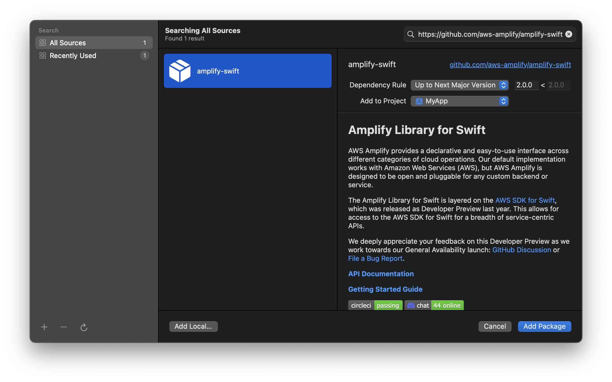
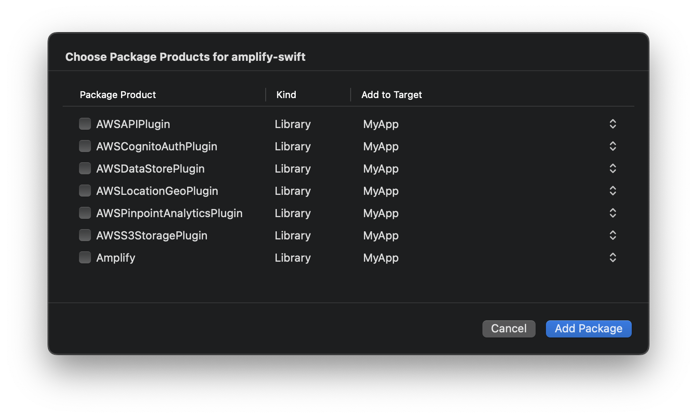

## Amplify Library for Swift


AWS Amplify provides a declarative and easy-to-use interface across different categories of cloud operations. Our default implementation works with Amazon Web Services (AWS), but AWS Amplify is designed to be open and pluggable for any custom backend or service.

The Amplify Library for Swift is layered on the [AWS SDK for Swift](https://aws.amazon.com/sdk-for-swift/), which was released as Developer Preview last year. This allows for access to the AWS SDK for Swift for a breadth of service-centric APIs.

[**API Documentation**](https://aws-amplify.github.io/amplify-swift/docs/)

[**Getting Started Guide**](https://docs.amplify.aws/start/q/integration/ios)

[](https://circleci.com/gh/aws-amplify/amplify-swift)
[](https://discord.gg/jWVbPfC)

## Features/APIs

- [Analytics](https://docs.amplify.aws/lib/analytics/getting-started/q/platform/ios) - for logging metrics and understanding your users.
- [API (GraphQL)](https://docs.amplify.aws/lib/graphqlapi/getting-started/q/platform/ios) - for adding a GraphQL endpoint to your app.
- [API (REST)](https://docs.amplify.aws/lib/restapi/getting-started/q/platform/ios) - for adding a REST endpoint to your app.
- [Authentication](https://docs.amplify.aws/lib/auth/getting-started/q/platform/ios) - for managing your users.
- [DataStore](https://docs.amplify.aws/lib/datastore/getting-started/q/platform/ios) - for making it easier to program for a distributed data store for offline and online scenarios.
- [Geo](https://docs.amplify.aws/lib/geo/getting-started/q/platform/ios) - for adding location-based capabilities to your app.
- [Predictions](https://docs.amplify.aws/lib/predictions/getting-started/q/platform/ios/) - for connecting your app with machine learning services.
- [Push Notifications](https://docs.amplify.aws/lib/push-notifications/getting-started/q/platform/ios/) - for integrating push notifications in your app.
- [Storage](https://docs.amplify.aws/lib/storage/getting-started/q/platform/ios) - store complex objects like pictures and videos to the cloud.

## Platform Support

| Platform  | Versions  | Support Level |
| ---------: | -------:  | :-----------: |
| iOS       | 13+       | GA            |
| macOS     | 10.15+    | GA            |
| tvOS      | 13+       | GA            |
| watchOS   | 7+        | GA            |
| visionOS  | 1+        | Preview       |

To use the `visionos-preview` branch, add Amplify Swift via SPM with the **Dependency Rule: Branch** targeting `visionos-preview`.


## License

This library is licensed under the Apache 2.0 License. 

## Installation

Amplify requires Xcode 13.4 or higher to build for iOS and macOS. Building for watchOS and tvOS requires Xcode 14.3 or higher.

| For more detailed instructions, follow the getting started guides in our [documentation site](https://docs.amplify.aws/lib/q/platform/ios)   |
|-------------------------------------------------|

### Swift Package Manager

1. Swift Package Manager is distributed with Xcode. To start adding the Amplify Libraries to your iOS project, open your project in Xcode and select **File > Add Packages**.

    

1. Enter the Amplify Library for Swift GitHub repo URL (`https://github.com/aws-amplify/amplify-swift`) into the search bar.

1. You'll see the Amplify Library for Swift repository rules for which version of Amplify you want Swift Package Manager to install. Choose **Up to Next Major Version** and enter **2.0.0** as the minimum version for the Dependency Rule, then click **Add Package**.

    

1. Choose which of the libraries you want added to your project. Always select the **Amplify** library. The "Plugin" to install depends on which categories you are using:

    - API: **AWSAPIPlugin**
    - Analytics: **AWSPinpointAnalyticsPlugin**
    - Auth: **AWSCognitoAuthPlugin**
    - DataStore: **AWSDataStorePlugin**
    - Geo: **AWSLocationGeoPlugin**
    - Storage: **AWSS3StoragePlugin**

    

    Select all that are appropriate, then click **Add Package**.

    You can always go back and modify which SPM packages are included in your project by opening the `Package Dependencies` tab for your project: Click on the Project file in the Xcode navigator, then click on your project under the Project section, then select the **Package Dependencies** tab.

1. In your app code, explicitly import a plugin when you need to add a plugin to Amplify, access plugin options, or access a category escape hatch.

    ```swift
    import Amplify
    import AWSCongitoAuthPlugin
    import AWSAPIPlugin
    import AWSDataStorePlugin

    // ...

    func initializeAmplify() {
        do {
            try Amplify.add(AWSCognitoAuthPlugin())
            try Amplify.add(AWSAPIPlugin())
            try Amplify.add(AWSDataStorePlugin())
            // and so on ...
            try Amplify.configure()
        } catch {
            assertionFailure("Error initializing Amplify: \(error)")
        }
    }
    ```

    If you're just accessing Amplify category APIs (e.g., `Auth.signIn()` or `Storage.uploadFile()`), you only need to import Amplify:

    ```swift
    import Amplify

    // ...

    func signIn() async throws {
        let signInResult = try await Amplify.Auth.signIn(...)
        // ...
    }
    ```

## Escape Hatch

All services and features not listed in the [**Features/API sectios**](#featuresapis) are supported via the [Swift SDK](https://github.com/awslabs/aws-sdk-swift) or if supported by a category can be accessed via the Escape Hatch like below:

```swift
import Amplify
import AWSS3StoragePlugin
import AWSS3

// ...

guard let plugin = try Amplify.Storage.getPlugin(for: "awsS3StoragePlugin") as? AWSS3StoragePlugin else {
    print("Unable to to cast to AWSS3StoragePlugin")
    return
}

let awsS3 = plugin.getEscapeHatch()

let accelerateConfigInput = PutBucketAccelerateConfigurationInput()
do {
    let accelerateConfigOutput = try await awsS3.putBucketAccelerateConfiguration(
        input: accelerateConfigInput
    )
    print("putBucketAccelerateConfiguration output: \(accelerateConfigOutput)")
} catch {
    print("putBucketAccelerateConfiguration error: \(error)")
}
```

## Reporting Bugs/Feature Requests

[](https://github.com/aws-amplify/amplify-swift/issues?q=is%3Aissue+is%3Aopen+label%3Abug)
[](https://github.com/aws-amplify/amplify-swift/issues?q=is%3Aissue+label%3A%22question%22+is%3Aopen+)
[](https://github.com/aws-amplify/amplify-swift/issues?q=is%3Aissue+label%3A%22feature-request%22+is%3Aopen+)
[](https://github.com/aws-amplify/amplify-swift/issues?q=is%3Aissue+is%3Aclosed+)

We welcome you to use the GitHub issue tracker to report bugs or suggest features.

When filing an issue, please check [existing open](https://github.com/aws-amplify/amplify-swift/issues), or [recently closed](https://github.com/aws-amplify/amplify-swift/issues?utf8=%E2%9C%93&q=is%3Aissue%20is%3Aclosed%20), issues to make sure somebody else hasn't already
reported the issue. Please try to include as much information as you can. Details like these are incredibly useful:

* Expected behavior and observed behavior
* A reproducible test case or series of steps
* The version of our code being used
* Any modifications you've made relevant to the bug
* Anything custom about your environment or deployment

## Open Source Contributions

We welcome any and all contributions from the community! Make sure you read through our contribution guide [here](./CONTRIBUTING.md) before submitting any PR's. Thanks! ♥️
